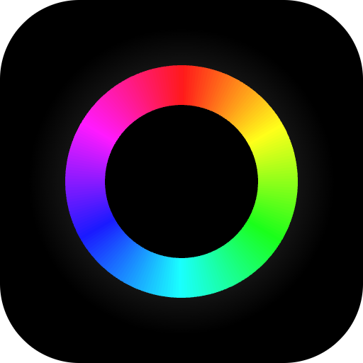
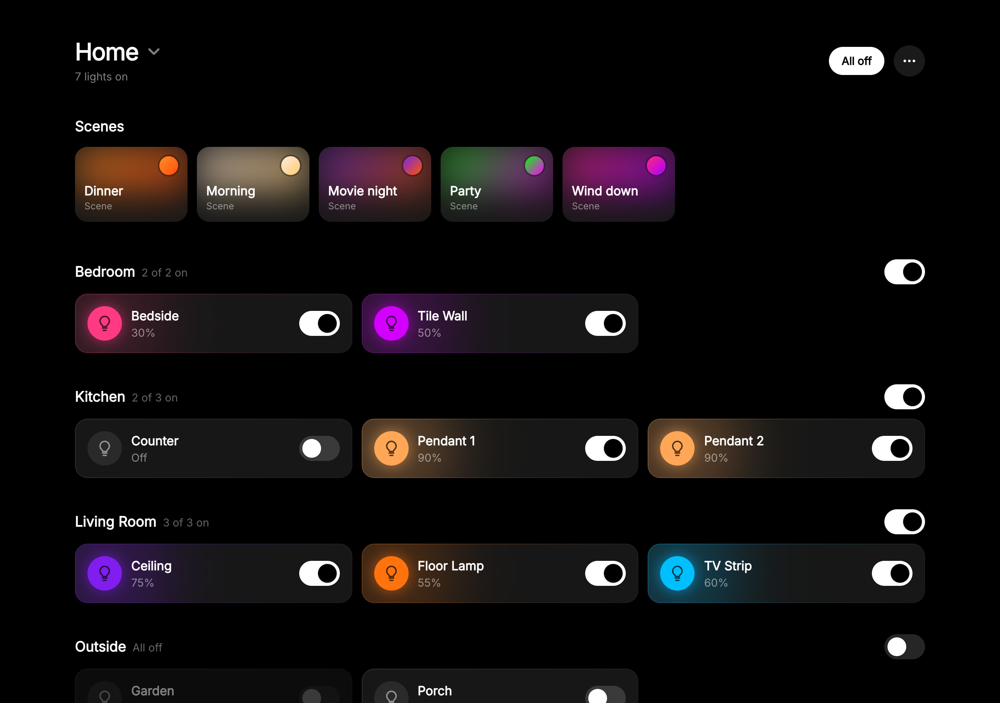
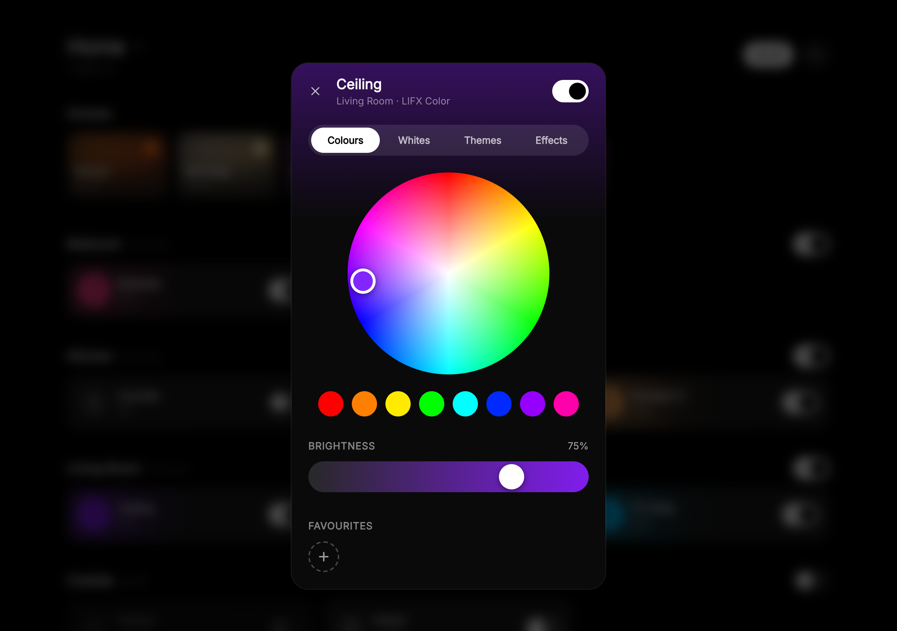
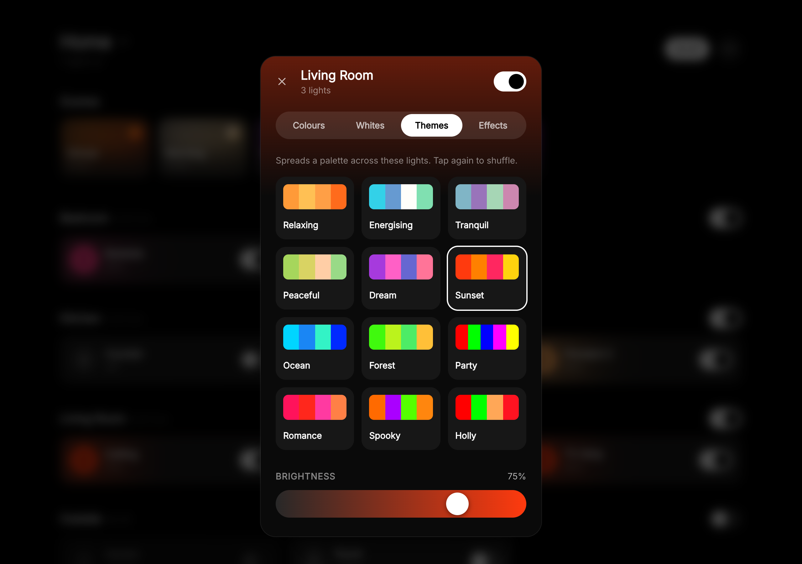
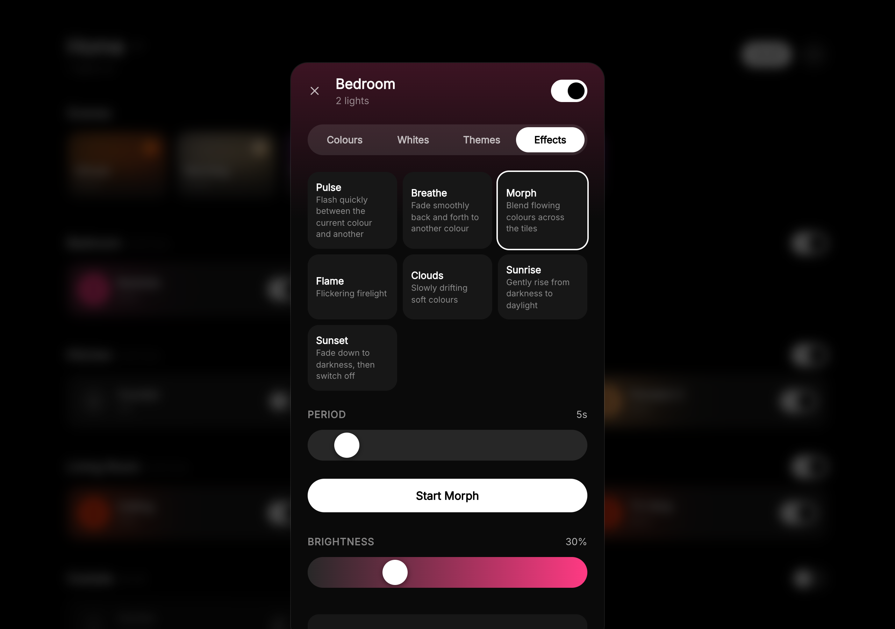
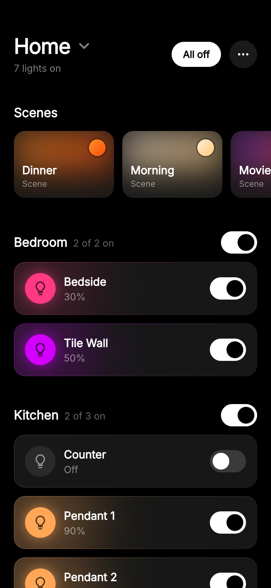
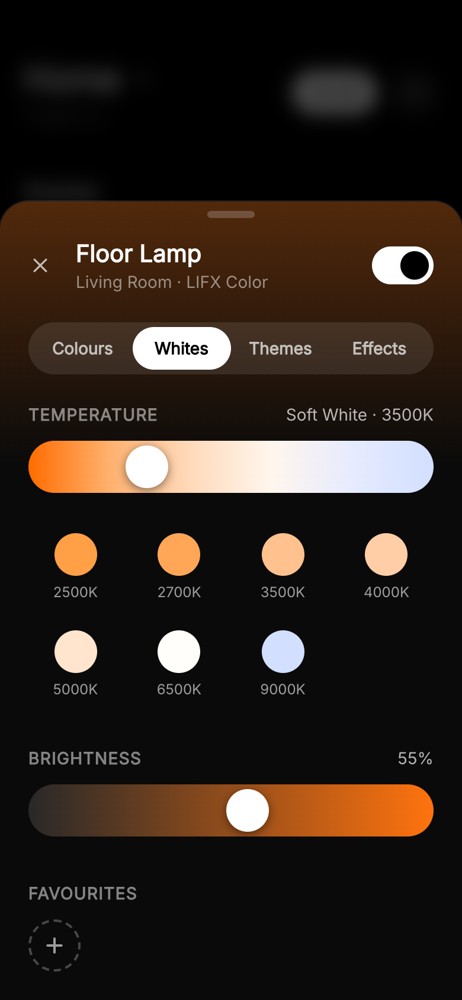
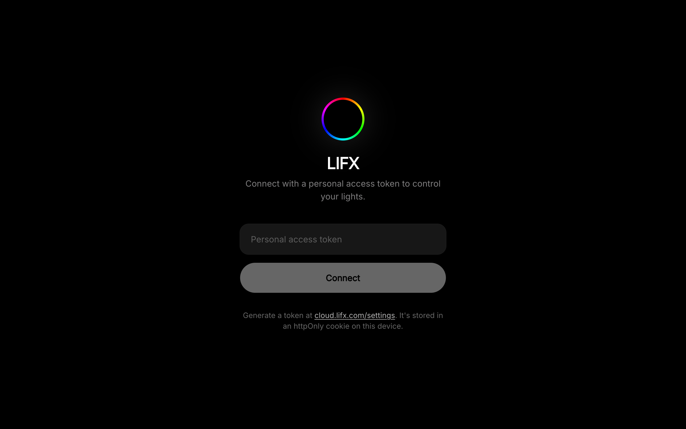

<p align="center">
  
</p>

# LIFX Web Panel

A 100% vibecoded Nuxt + Tailwind web panel for controlling LIFX lights.



## Features

- Switch between locations (places), persisted in a cookie
- Lights grouped by room, with per-group and per-location power
- Colour wheel, whites (colour temperature) and brightness for a light or a whole group
- Scenes saved in the LIFX app, activated from the dashboard
- Themes: colour palettes spread across a room (strips get a band of each colour)
- Effects: pulse and breathe on any colour light, move on strips, morph/flame/clouds/sunrise/sunset on Tiles and Candles
- Favourites: save the current colour and brightness and apply it anywhere (stored in this browser)
- Clean (HEV) cycles and Nightvision infrared level on bulbs that support them

## Screenshots

| Colours | Themes | Effects |
| --- | --- | --- |
|  |  |  |

On phones the controls open as a bottom sheet:

<p>
  
  &nbsp;
  
</p>

## Setup

```bash
npm install
npm run dev
```

Open the app and paste a personal access token from <https://cloud.lifx.com/settings>.



The token is stored in an httpOnly cookie and requests are proxied through `/api/lifx/*`,
so it's never readable by client-side JavaScript.

## Limitations

These come from the LIFX HTTP API rather than the panel:

- Scenes can be activated but not created or edited — make them in the LIFX app.
- Rooms, locations and device setup can't be changed.
- The API doesn't report whether a Clean cycle is running, or the current Nightvision level.
- Individual Tile/Candle pixels can't be set, so themes give each Tile a single colour.
